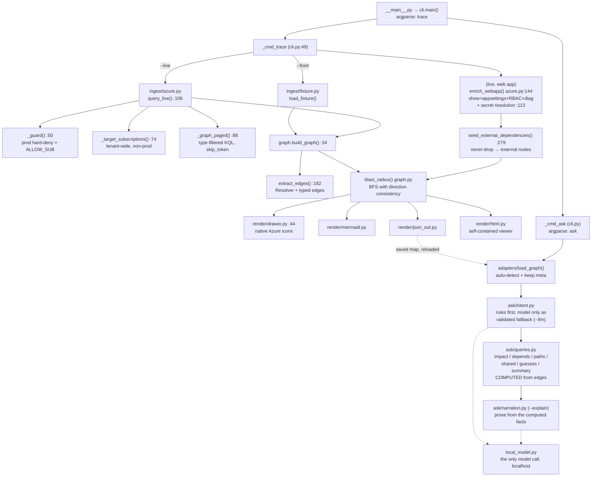

# Architecture

> Written in English to match the rest of the repo (README, code, comments).
> `file.py:NN` references are indicative - they drift as the code moves. Trust the
> function and file names; grep for the symbol rather than jumping to the line.

## Overview

cloudmap is a local-first CLI (Python 3.9+, zero dependencies — `pyproject.toml:14`)
that takes the **name of one Azure resource** and produces its full **dependency
graph (blast radius)** as an **editable draw.io diagram** (plus Mermaid and JSON).
It is a clean four-stage pipeline: **ingest** (fixture or live `az`) → **extract**
(properties / hostnames / secrets → typed edges) → **graph** (blast-radius BFS with
hub boundaries) → **render**. The core value is that Azure Resource Graph has no
"dependencies" table, so `extract/extractors.py` infers dependencies and
**verifies** each one — anything referenced but not verified becomes an explicit
`external` node instead of being silently dropped.

## Architecture

## File Map

| File | Role | Why it's built this way |
|---|---|---|
| `cloudmap/model.py` | `Node`/`Edge`/`Graph` dataclasses | Provider-neutral core. The `external`+`note` fields (`model.py:31-32`) exist for the "never silent drop" principle — a referenced-but-unverified target still needs a place in the model. |
| `cloudmap/ingest/fixture.py` | Load synthetic/captured JSON | Accepts both a bare list and `{"data":[...]}` (`:11-13`) so the same file works as a fixture and as captured `az graph` output. |
| `cloudmap/ingest/azure.py` | Live `az` ingest + enrichment | The most sensitive file, so it concentrates every guard (`HARD_DENY_HINTS` :20, `_guard` :50). Kept separate from extraction so the dependency logic stays pure and testable without Azure. |
| `cloudmap/extract/extractors.py` | **The heart**: properties/hosts/secrets → edges | The project's IP. `Resolver` (:97) builds indexes (by_id/by_host/by_principal/kv_by_name/…); `_DOMAIN_KIND` (:27) maps service domains to edge kinds. |
| `cloudmap/graph.py` | Build graph + blast-radius BFS + the high-level collapse | Direction consistency in `blast_radius` (never reverse once you have stepped) is why a shared VNet/ASP does not pull in unrelated apps — a central design choice. `collapse_high_level` folds instances into one box per type and must carry their kinds AND evidence across, or the default view would show unfalsifiable arrows. |
| `cloudmap/render/drawio.py` | `.drawio` with Azure2 icons | `AZURE_ICON` (:14) = verified paths; falls back to a box, external nodes render dashed (`:64`) so an icon is never broken. |
| `cloudmap/render/{mermaid,json_out}.py` | Secondary outputs | Quick preview + machine-readable inventory. |
| `cloudmap/ask/queries.py` | **The Ask layer's heart**: the six queries, each computed by traversal | An answer must be auditable, so it is derived from edges, never generated. `_trust()` grades a whole path by its weakest hop, and distinguishes *passing through* an unverified node (whole finding becomes a guess) from *ending* at one (the reference is proven; the target is flagged). |
| `cloudmap/ask/intent.py` | Question → one query | Rules first so the common phrasings need no model at all (including the "rotate / restart / decommission" verbs). The model is a fallback that may only name a query from a fixed list and a resource, both validated against the graph — it routes, it never answers. |
| `cloudmap/ask/narration.py` | Optional prose (`--explain`) | Handed the computed facts only, and printed *below* them, so drifting prose is visibly a narration disagreeing with the facts, not a wrong answer. |
| `cloudmap/local_model.py` | The single outbound model call | One module = one auditable promise: the call goes to localhost (ollama) and failure returns an empty value, because cloudmap must be fully useful with no model installed. |
| `cloudmap/cli.py` | Orchestration + argparse | `_cmd_trace` wires the trace stages together (live enrichment + external merge live here); `_cmd_ask` loads a saved map and prints the computed answer, proof lines included. |
| `fixtures/contoso.json` | 100% synthetic estate | Fixture-first development → zero cloud contact in tests. |
| `tests/test_graph.py` | 5 unit tests | Lock in the hub-boundary behaviour + edge-kinds against the fixture. |
| `.gitignore` | Safety | `live/`, `*.blast.drawio` ignored → nothing from a real cloud ends up in the repo. |

## Execution Flow

**Fixture path** (`cloudmap trace contoso-web --from fixtures/contoso.json`):

1. `__main__.py:6` → `sys.exit(main())`.
2. `cli.py:15` `main()` — argparse defines the `trace` subcommand and flags
   (`--from/--live/--resolve-secrets/--single-sub/--direction`).
3. `cli.py:49` `_cmd_trace` — fixture branch → `load_fixture()` (`fixture.py:9`)
   returns a list of resource dicts.
4. `graph.py:34` `build_graph()` → builds `Node`s and calls `extract_edges()`.
5. `extract_edges()` — constructs a `Resolver` and, per node, derives edges:
   `serverFarmId`→hosted-on, `virtualNetworkSubnetId`→vnet-integration, private
   endpoints, role assignments, and for config-bearing workloads →
   `_config_edges()` matching hostnames/vault refs/IK. Web apps add the
   `linuxFxVersion` image; container apps add `environmentId`, `registries`,
   `secrets[].keyVaultUrl` and `template.containers[].image`.
6. `find_seeds()` — exact name match, else substring; >1 → ambiguity exit.
7. `blast_radius()` — BFS from the seed in both directions, but **never reversing**
   once it has stepped one way. That single rule is what stops a shared plan or
   VNet from bridging the seed into unrelated apps.
8. `to_drawio()` — layered layout by hop-distance, Azure icon or box/dashed;
   `_print_summary` prints the edges, plus any blind spot the scan left.

**Live path** (`--live --allow-live --resolve-secrets`) — additionally in `_cmd_trace`:

9. `query_live()` → `_guard()` (prod hard-deny + `CLOUDMAP_ALLOW_SUBSCRIPTION` ==
   active sub) → `_target_subscriptions()` (all Enabled non-prod) → `_graph_paged()`
   (type-filtered KQL, `skip_token` paging, warns when it hits the cap).
10. `_enrich_live()` (`cli.py`) picks which web apps to deep-enrich via
    `_enrichment_targets()`, then `enrich_webapps()` runs them concurrently:
    `az webapp show` (identity/vnet/image), appsettings/connection-strings; with
    `--resolve-secrets`, `_maybe_resolve()` → `_resolve_secret()` substitutes
    `@Microsoft.KeyVault(...)` **in-memory**; + role assignments + diagnostics.
11. Rebuild the graph, then `seed_external_dependencies()` adds dashed external
    nodes for anything the seed references but the scan never resolved, plus
    diagnostics edges, then `_dedupe`. Whatever was *not* enriched is recorded as
    a blind spot in `meta` so the artifact — and every `ask` answer drawn from it —
    repeats it.

## Design Decisions

- **extract vs ingest separation** (`extractors.py` knows nothing about `az`). All
  dependency logic is pure Python over dicts, so the 5 tests run without Azure.
- **Direction consistency** (`blast_radius`). Real-world testing showed shared ASP/VNet
  connect dozens of unrelated apps. The rule "from the seed go both ways, but never
  reverse afterwards" solves it without a list of which types count as hubs. The most
  opinionated part, and correctly a single line.
- **Enrichment is scoped, and the gap is declared** (`_enrichment_targets`). Config-level
  edges only exist for apps that were deep-enriched, so enriching just the seed makes
  the graph asymmetric. `auto` enriches every app when the seed is shared infrastructure
  (the only way to learn its dependents) and just the seed when the seed is itself an
  app. Whatever is skipped becomes a `blind_spot` in `meta` — an empty upward answer
  must never be mistaken for "nothing depends on this".
- **Scrub preserves structure, not identity** (`scrub.py`). The substitution is global
  and consistent so a reference and its target stay correlated; `tests/test_scrub.py`
  asserts the graph shape is byte-identical before and after, which is what makes a
  committed real capture worth anything.
- **Never silent drop** (`extractors.py:279` + `model.py:31`). `extract_edges` drops
  unresolved targets (noise at tenant scale), but the seed-scoped pass resurfaces them
  as external — a clean separation of responsibility across the two functions.
- **Security-by-design in ingest**: `_guard()` (`azure.py:50`) demands an explicit env
  var equal to the exact active sub id, and `_target_subscriptions` (`:82`) filters out
  prod. Secrets are resolved in-memory only (`_resolve_secret` :113) and `.gitignore`
  keeps `live/` out of the repo.
- **Verified icon paths** (`drawio.py:14`) — image shapes over mxgraph stencils, likely
  because the azure2 SVGs ship inside draw.io (the repo ships no icon assets).

## Open Questions / Risks

- **`az graph --skip-token`** (`azure.py:98`): works here but depends on the
  resource-graph extension version; another version may require a `--skip` fallback.
- **Deep-enrich only for `microsoft.web/sites`**: AKS or SQL as a seed still get ARM
  topology only. Container apps need no enrichment (Resource Graph returns their
  template), but an AKS workload's real dependencies live in Kubernetes manifests,
  which nothing here reads.
- **Cost of `--enrich all`**: one `az` round-trip per app, eight at a time. On a
  tenant with hundreds of apps the default `auto` keeps this off the common path, but
  tracing a shared Key Vault in a large tenant is genuinely slow.
- **No icons for Container Apps**: `AZURE_ICON` / `AZURE_SVG` entries are only added
  once the asset path is verified against the azure2 set, so container apps currently
  render as a labelled box rather than a wrong icon.
- **Secret resolution reachability**: `_resolve_secret` calls `az keyvault secret show`;
  if the vault is behind a private endpoint without connectivity it fails silently
  (try/except) and the data-plane dependency shows as external rather than resolved.
