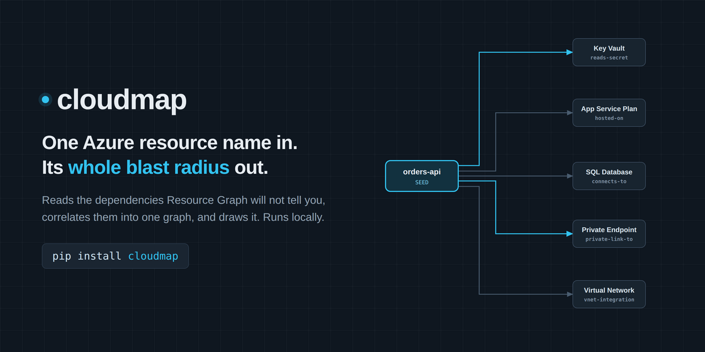
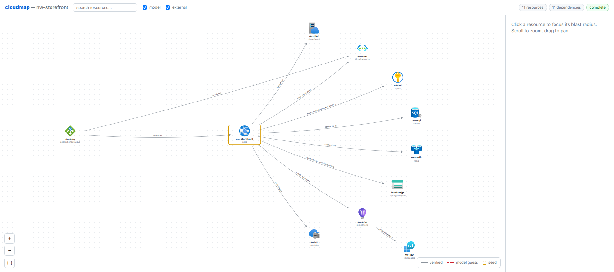

<div align="center">



<p>
  <a href="https://github.com/KatsaounisThanasis/cloudmap/actions/workflows/ci.yml"></a>
  <a href="https://pypi.org/project/cloudmap/"></a>
  <a href="https://pypi.org/project/cloudmap/"></a>
  <a href="LICENSE"></a>
</p>

<p>
  <a href="#install"><b>Install</b></a> ·
  <a href="#60-second-demo"><b>Demo</b></a> ·
  <a href="#interactive-wizard"><b>Wizard</b></a> ·
  <a href="#why"><b>Why</b></a> ·
  <a href="#how-it-works"><b>How it works</b></a> ·
  <a href="#ask-a-map-questions"><b>Ask</b></a>
</p>

</div>

---

Azure Resource Graph has no "dependencies" table. The relationships that matter
- what an App Service is hosted on, which Key Vault it reads, which subnet it
integrates with, which managed identity has which role where, what a Private
Endpoint fronts, which App Gateway routes to it - are buried inside each
resource's `properties`. cloudmap reads them out, correlates them into one
graph, and draws it.

## Install

```
pip install cloudmap
```

Python 3.9+. Two runtime dependencies (`rich` and `questionary`, both for the
terminal UI). Live mode additionally needs the [Azure CLI](https://learn.microsoft.com/cli/azure/install-azure-cli)
on your PATH. The optional AI passes need a local model server - [ollama](https://ollama.com)
works out of the box, and any OpenAI-compatible server (LM Studio, llama.cpp,
vLLM, LocalAI) works via two env vars:

```
export CLOUDMAP_LLM_URL=http://localhost:1234/v1/chat/completions   # your server
export CLOUDMAP_LLM_MODEL=<model name>                              # default: qwen2.5-coder:3b
```

<details>
<summary>Working on it instead</summary>

```
git clone https://github.com/KatsaounisThanasis/cloudmap && cd cloudmap
pip install -e ".[dev]" && pytest
```

</details>

## 60-second demo

No Azure account needed - the repo ships a synthetic estate:

```
cloudmap trace contoso-web --from fixtures/contoso.json -o contoso-web.drawio
```

```text
Blast radius: 9 resources (0 external), 9 dependencies
╭────────────────────────────── Dependency Graph ──────────────────────────────╮
│ 🌐 contoso-web                                                               │
│ ├── --hosted-on--> 📦 App Service Plan                                       │
│ ├── --vnet-integration--> 📦 Virtual Network                                 │
│ ├── --connects-to--> 🗄️ SQL Server                                           │
│ ├── --sends-telemetry--> 📦 App Insights                                     │
│ │   └── --uses-workspace--> 📦 Log Analytics                                 │
│ ├── --reads-secret; role: Key Vault Secrets User--> 🔐 Key Vault             │
│ └── --connects-to--> 📦 Storage                                              │
╰──────────────────────────────────────────────────────────────────────────────╯
🔗 draw.io: contoso-web.drawio
```

That is the default **high-level** view - resources grouped by type. Add
`--level detail` to see every instance with its real name, and on a real estate
it goes several layers deep:

<details>
<summary>A deeper map</summary>

```text
Blast radius: 15 resources (0 external), 14 dependencies
╭────────────────────────────── Dependency Graph ──────────────────────────────╮
│ 🌐 app-spa-frontend                                                          │
│ ├── --calls--> 🌐 app-auth-service                                           │
│ │   ├── --reads-secret--> 🔐 kv-core-prod                                    │
│ │   └── --connects-to--> 🗄️ cosmos-auth                                      │
│ └── --calls--> 🌐 app-api-gateway                                            │
│     ├── --calls--> 📦 capp-payment-service                                   │
│     │   └── --reads-secret--> 🔐 kv-payments-prod                            │
│     ├── --calls--> 🌐 app-inventory-api                                      │
│     │   ├── --connects-to--> 🗄️ pg-inventory-prod                            │
│     │   └── --connects-to--> 📦 stinventoryprod                              │
│     ├── --connects-to--> 🗄️ redis-gateway                                    │
│     └── --calls--> 🌐 app-orders-api                                         │
│         ├── --connects-to--> 🗄️ redis-orders                                 │
│         ├── --connects-to--> 📦 sb-enterprise                                │
│         └── --connects-to--> 🗄️ sql-orders-prod                              │
╰──────────────────────────────────────────────────────────────────────────────╯
```

</details>

### What you get out

| Flag | Output |
|---|---|
| `-o FILE` | **draw.io** diagram with native Azure icons - open it in [draw.io](https://app.diagrams.net), the desktop app or the VS Code extension and edit it like any hand-drawn diagram |
| `--html FILE` | **Interactive viewer** - one self-contained file, no server and no CDN |
| `--mermaid FILE` | Mermaid source, for embedding in Markdown docs |
| `--json FILE` | The graph itself - this is what `cloudmap ask` reads |
| `--csv FILE` | Flat edge list with evidence, for a spreadsheet or an auditor |

<div align="center">
  
</div>

The `--html` viewer has a dark mode, edges colour-coded by relationship type
(security / data / network), resource-group filters and search, SVG and PNG
export, and direct links into the Azure portal.

## Interactive wizard

Run it with no arguments and it walks you through the whole thing:

```
cloudmap
```

It asks for a subscription (yours is marked as the default), then a resource
group, then the resource to trace, then how deeply to enrich, and where to write
the results. It reads live Azure, so `az login` first.

## Why

- **Live-cloud tools upload your data.** cloudmap runs locally and reads only
  what you point it at. Nothing leaves your machine.
- **Existing OSS is siloed** - Terraform-only or Kubernetes-only. cloudmap works
  from Azure's own inventory (Resource Graph) and correlates across services.
- **Impact analysis, onboarding, change reviews.** "What breaks if I touch this?"
  in one diagram instead of ten portal blades.

### Three things people use it for

**Is this safe to delete?** An Azure SQL database looks orphaned in the portal and
someone wants it gone to save the monthly bill. `cloudmap trace sql-orders-dev
--direction up` deep-enriches the connection strings of the web apps in the
subscription and shows what still points at it - including, occasionally, a
production app that was never supposed to.

**What is actually broken?** An AKS cluster starts failing at 3am. Tracing it
produces a dependency graph with the Key Vault it reads, and the map carries the
evidence for that edge ("found in Kubernetes secret X"), so the next question -
did anything change on that vault - has a place to start.

**Who has access to this?** An auditor asks which systems can reach the storage
account holding customer data. `cloudmap trace pii-storage --direction up --csv
pii-audit.csv` hands back a spreadsheet of the web apps and clusters with managed
identity RBAC on it, with the role assignments as proof.

## What it maps

**Any Azure resource type can be a seed.** The scan is not filtered by type, and
resources are mapped at two levels:

- **Typed rules** for the services where the relationship has a specific meaning:
  App Service / Functions, Container Apps (+ environments), AKS, App Gateway, API
  Management, Key Vault, Storage, SQL / PostgreSQL / MySQL / Cosmos, Redis, Service
  Bus, Event Hub, Cognitive Search, Azure OpenAI, Container Registry, ML workspaces,
  Log Analytics, App Insights, VNets, Private Endpoints and managed identities.
  These produce edges like `hosted-on`, `reads-secret`, `pulls-image`, `routes-to`.
- **A generic ARM-reference pass** for everything else: any resolvable resource id
  found in a resource's properties becomes a `references` edge, with the property
  path as proof. So a type cloudmap has never heard of is still mapped, still
  deterministically, still with evidence.

RBAC edges (`role: Key Vault Secrets User`) are extracted tenant-wide, so
"who has access to this" works for any resource that can be a role scope.

Depth is honest about itself: apps and clusters have rich outbound edges because
their config names other resources. Infrastructure resources are usually leaves
going outward, and their value is the reverse view (`--direction up`).

## How it works

1. **Ingest** - a JSON fixture (default) or live `az graph query` (opt-in, guarded).
2. **Extract** - per-type rules turn `properties` into typed edges
   (`hosted-on`, `reads-secret`, `private-link-to`, `role: ...`, `routes-to`, ...).
3. **Blast radius** - walk the graph from your seed with *direction consistency*:
   from the seed it goes both ways (what it depends on **and** what depends on
   it), but once it steps in one direction it never reverses. That single rule
   keeps a shared resource (App Service Plan, VNet, Key Vault) from bridging your
   seed to unrelated apps sitting on the same thing.
4. **Render** - draw.io (Azure icons) + Mermaid + JSON + CSV + a self-contained HTML viewer.
5. **Ask** - query the saved map in plain language (`cloudmap ask`); the answers are
   computed from the graph, and a local model may only route the question or narrate
   the result.

## Ask a map questions

```
$ cloudmap trace contoso-web --from fixtures/contoso.json --level detail --json out.json
$ cloudmap ask out.json "what breaks if I touch contoso-kv"
Query: impact  ·  subject: contoso-kv
2 resource(s) depend on contoso-kv - changing it can break them.

  contoso-web  (Web App)  1 hop(s)
      contoso-web --reads-secret; role: Key Vault Secrets User--> contoso-kv
          proof: app config references host contoso-kv.vault.azure.net; Key Vault
                 reference to vault contoso-kv; RBAC role assignment
  contoso-agw  (App Gateway)  2 hop(s)
      ...
```

Questions it answers: what breaks if I touch X · what does X depend on · how does
X reach Y · what is shared in this map · what should I not trust · explain this map.

**The answers are computed, not generated.** "What breaks if I touch X" is a graph
traversal, so that is how it is answered - the numbers and names come from the
edges. A local model is optional and can only do two things: pick which query an
unusual phrasing meant (`--llm`, and its pick is validated against the map), or put
the already-computed facts into prose (`--explain`). It never supplies a fact, so it
cannot promote a guess to one. Every finding shows the hops behind it and the proof
of each hop, and a finding that leans on a model-proposed edge is marked `[GUESS]`.
If the map itself says it is incomplete, every answer from it repeats that warning.

<details>
<summary><b>Flags</b></summary>

```
cloudmap ask <map.json> "<question>"

  --explain      also narrate the answer with a LOCAL model
  --llm          if no built-in rule understands the phrasing, let a LOCAL model
                 pick the query (its choice is validated against the map)
  --max-hops N   limit traversal depth
  --json         print the answer as JSON (for scripting)
```

Instance names only exist in a `--level detail` map; the default high-level map
groups by type, so ask it about a group (`"what breaks if I touch Key Vault"`) or
trace with `--level detail` first.

</details>

## Live Azure

Fixtures are the default. Live mode is opt-in and **not sandboxed**: `--allow-live`
is the deliberate switch, and cloudmap reads whatever subscription `az` is pointed
at. The read is read-only, but it is a read of live infrastructure, so point it on
purpose. **Do not point this at data you are not authorized to read.**

One asterisk on "read-only": AKS manifests are read through `az aks command
invoke`, which Azure implements by starting a short-lived pod in the cluster to
run the (read-only) `kubectl get` commands. Nothing of yours is modified, but an
audit of the cluster's control plane will see that ephemeral pod.

Tenant-wide enrichment runs its `az` reads concurrently; `CLOUDMAP_ENRICH_WORKERS`
(default 12) tunes how many at once.

```
cloudmap trace my-app --live --allow-live
```

**cloudmap runs as you.** It has no credentials of its own - every read goes through
the Azure CLI with your `az login` token, so it sees exactly what your account can
see and nothing more. Resource Graph filters by RBAC, so resources you cannot read
simply do not appear (Azure raises no error for them - they are invisible, not
denied). Deep reads your role does not allow (app settings, Key Vault values, AKS
manifests) fail visibly instead: cloudmap **reports the gap** on the map rather than
silently dropping edges, and warns when a scan is truncated - so a small graph on a
low-privilege account reads as "this is what I was allowed to see", not "this is
everything".

<details>
<summary><b>Flags, enrichment and the subscription pin</b></summary>

```
  --single-sub          query only the active subscription (default: every enabled
                        subscription in the tenant)
  --enrich MODE         which web apps to deep-enrich for the dependencies that only
                        exist in app config. auto (default) = the seed alone when the
                        seed is a workload; every app in scope when the seed is a data
                        service whose dependents hide in app config (Key Vault,
                        storage, SQL, Redis, ...); the seed alone for compute and
                        network resources, whose relationships ARM already returns;
                        all | seed | none
  --resolve-secrets     read KV secret values in-memory to see through KV-backed
                        connection strings (never printed or written)
  --llm                 let a LOCAL model propose extra edges, each
                        verified against scanned resources before it is trusted
```

**Why `--enrich` matters.** A Key Vault reference or a connection string lives in an
app's settings, which Resource Graph does not return - so that edge exists only once
that app has been deep-enriched. Enriching only the seed would make the graph
asymmetric: tracing an app finds the vault it reads, but tracing the vault would never
find the app. Since "what breaks if I touch this" is usually asked about shared
infrastructure, `auto` enriches every app in scope whenever the seed is *not* an app.
Anything left un-enriched is reported as a **blind spot** on the map and repeated by
every `ask` answer drawn from it, so an empty result never passes for "nothing depends
on this".

As an optional guard against a stale `az` context silently redirecting a scan, pin the
subscription you mean - if set, cloudmap refuses to run against any other active
subscription:

```
export CLOUDMAP_ALLOW_SUBSCRIPTION=<subscription-id>   # optional
```

</details>

<details>
<summary><b>Capture a real export (so the tests can be wrong)</b></summary>

A fixture you wrote yourself can only confirm what you already believe. `capture`
saves what Azure actually returned, scrubs it, and gives you something that can
contradict the extractors.

```
cloudmap capture --allow-live --single-sub -o fixtures/captured_real.json
cloudmap scrub  raw-export.json -o fixtures/captured_real.json   # for a file you already have
```

The scrub is a **global, consistent** pseudonymisation, not a field-by-field
blanking: `kv-payments` becomes `kv-1` everywhere at once, so the app setting that
references `kv-payments.vault.azure.net` still points at the same vault
afterwards. What survives on purpose: service domain suffixes (the rules read them
to decide what an edge means), built-in role GUIDs (public Azure constants) and
private IP ranges (that is the topology). What does not: names, resource groups,
subscription and principal GUIDs, e-mails, public IPs, and any
password / key / SAS fragment, which is redacted rather than renamed.

The mapping is never written to disk - it is the re-identification key. Counts are
printed, the mapping is not. **A scrubber is not a proof: read the file before you
commit it.** `--no-scrub` exists for local debugging and writes credentials to
disk; keep those files named `*.live.json` so `.gitignore` catches them.

</details>

<details>
<summary><b>Usage reference</b></summary>

```
cloudmap trace <name> (--from <fixture.json> | --live) [options]

  --level high|detail        high = architecture view grouped by type (default);
                             one box per type, so instance names are not in the map
                             detail = every instance with its real name
  --direction both|down|up   both = full blast radius (default)
                             down = only what it depends on
                             up   = only what depends on it
  --max-hops N               limit traversal depth
  -o FILE                    draw.io output (default: <name>.blast.drawio)
  --mermaid FILE             also write Mermaid
  --json FILE                also write the graph as JSON
  --html FILE                also write a self-contained interactive HTML viewer
  --csv FILE                 also write the edge list as CSV
  -d, --out-dir DIR          write every artifact into DIR, named after the seed
```

Other subcommands: `cloudmap capture`, `cloudmap scrub`, `cloudmap ask`.

</details>

## Roadmap

- Terraform state ingestor + drift overlay (desired vs actual).
- Deeper AKS / Kubernetes workload correlation.
- Resource-group and application (tag-based) seeds.
- More edge extractors and Azure icon mappings (Container Apps still render as a
  labelled box - an icon is only added once its azure2 asset path is verified).

## License

MIT
